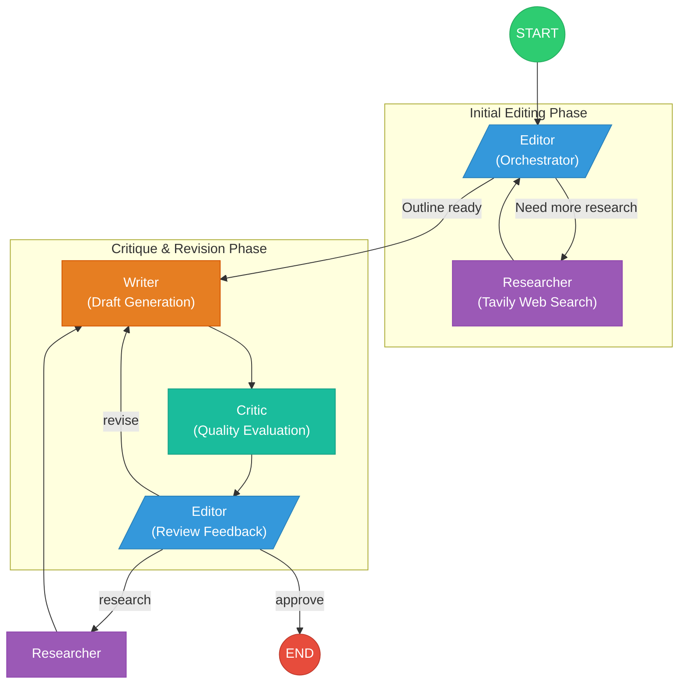

# Multi-Agent Essay Writer

> **An advanced agentic AI system demonstrating sophisticated multi-agent orchestration, adaptive workflows, and intelligent decision-making.**

A production-ready essay writing application built with LangGraph's multi-agent architecture, featuring an **Editor-orchestrated workflow** where agents collaborate through iterative feedback loops with intelligent routing decisions.

## 🎯 Project Goals

This project demonstrates:
- **Agentic Programming**: Building autonomous AI systems that make decisions and adapt behavior
- **Multi-Agent Orchestration**: Coordinating specialized agents with complex routing logic
- **Production Engineering**: Real-time streaming, per-agent model optimization, comprehensive monitoring
- **LangGraph Mastery**: Advanced state management, conditional edges, and workflow patterns

*Inspired by concepts from the Zero To Mastery (ZTM) LLM course and extended with production-grade features.*

## 🏗️ Architecture Overview

### The Four-Agent System

```
                    ┌──────────────────────────────────────┐
                    │        EDITOR (Orchestrator)         │
                    │  • Develops thesis & outline         │
                    │  • Commissions research              │
                    │  • Reviews critique & decides action │
                    │  • Strategic decision-making         │
                    └──────────────┬───────────────────────┘
                                   │
                 ┌─────────────────┼─────────────────┐
                 │                 │                 │
                 ▼                 ▼                 ▼
         ┌──────────────┐  ┌──────────────┐  ┌──────────────┐
         │  RESEARCHER  │  │    WRITER    │  │    CRITIC    │
         │  Tavily Web  │  │ Draft & Edit │  │  Evaluates   │
         │   Research   │  │    Essays    │  │   Quality    │
         └──────────────┘  └──────────────┘  └──────────────┘
```

### LangGraph Workflow Diagram



### Intelligent Workflow Routing

The **Editor** makes adaptive decisions based on workflow state:

**Phase 1: Initial Editing**
```
START → Editor → Researcher → Editor → ... (iterate until outline ready)
                                       ↓
                                    Writer (when ready)
```

**Phase 2: Critique & Revision Cycle**
```
Writer → Critic → Editor → (decision)
                            ├─> Researcher (more research needed)
                            ├─> Writer (revise with direction)
                            └─> END (essay approved)
```

### Key Innovation: Editor Decision-Making

Unlike simple linear workflows, the **Editor** reviews critic feedback and decides:
- **"research"**: Commission additional research to strengthen arguments
- **"revise"**: Provide direction for writer to address feedback
- **"approve"**: Essay meets quality standards

This creates a **dynamic, adaptive workflow** that responds to essay quality in real-time.

## ✨ Features

### Core Capabilities
- 📝 **Automated Research & Writing**: From topic to polished essay
- 🧠 **Intelligent Agent Orchestration**: Editor-driven adaptive workflow
- 🔄 **Multi-Phase Feedback Loops**: Separate editing and critique cycles
- ⚡ **Real-Time Progress Tracking**: Interactive timeline view with execution history

### Advanced Features
- 🎛️ **Per-Agent Model Configuration**: Optimize cost vs. quality per agent
- 📊 **LangSmith Integration**: Full traceability and performance monitoring
- 🌐 **Multi-Provider Support**: OpenAI, Anthropic (Claude), Google (Gemini)
- 💰 **Cost Optimization**: Use cheap models for research, premium for critical thinking
- 🔍 **Configurable Web Research**: Control query count and result depth with Tavily integration
- 📈 **Configurable Iteration Limits**: Control loops per editing/critique cycle
- 🕒 **Execution Timeline**: View detailed agent executions with clickable history

### Production Ready
- 🚀 **Streamlit Web Interface**: Professional, responsive UI with layout optimization
- ☁️ **Cloud Deployment**: Configured for Render.com
- 🛡️ **Error Handling**: Robust parsing and validation
- 📦 **Clean Architecture**: Modular, maintainable codebase
- 🎯 **Stable Layout**: Placeholder pattern prevents UI shifts during generation

## 🚀 Quick Start

### Prerequisites

- **Python 3.11+**
- **API Keys**:
  - At least one LLM provider (OpenAI / Anthropic / Google)
  - [Tavily](https://tavily.com/) for web research
  - [LangSmith](https://smith.langchain.com/) (optional, for monitoring)

### Installation

```bash
# Clone repository
git clone https://github.com/markgewhite/agentic_essay_writer.git
cd agentic_essay_writer

# Create virtual environment
python -m venv venv
source venv/bin/activate  # Windows: venv\Scripts\activate

# Install dependencies
pip install -r requirements.txt

# Configure environment
cp .env.example .env
# Edit .env with your API keys
```

### Configuration

Create `.env` file:

```bash
# LLM Providers (at least one required)
OPENAI_API_KEY=sk-...
ANTHROPIC_API_KEY=sk-ant-...
GOOGLE_API_KEY=...

# Research (required)
TAVILY_API_KEY=tvly-...

# Monitoring (optional but recommended)
LANGCHAIN_TRACING_V2=true
LANGCHAIN_API_KEY=lsv2_pt_...
LANGCHAIN_PROJECT=essay-writer
```

### Run

```bash
streamlit run app.py
```

Navigate to `http://localhost:8501`

## 💡 Usage Guide

### Model Selection Strategy

**Cost Optimization Example:**
- **Editor**: GPT-5.1 (most intelligent for strategic decisions)
- **Researcher**: GPT-5 Nano ($0.05/MTok - processes 50K tokens per research cycle!)
- **Writer**: GPT-5 Mini (balanced intelligence/cost)
- **Critic**: Claude Sonnet 4.5 (different perspective, rigorous evaluation)

The researcher agent uses ~50,000 tokens **per research request** (summarizing web results). Using cheap models here saves significant costs!

### Workflow Controls

**Iteration Limits:**
- **Max Editing Iterations** (2-12, default: 5): Research/outline refinement cycles
- **Max Critique Cycles** (1-8, default: 3): Full editor review → write/research → critique cycles
- **Max Writing Iterations** (2-8, default: 3): Revisions within a single critique cycle

**Research Parameters:**
- **Max Queries per Research Request** (1-5, default: 3): Number of search queries per research request
- **Max Results per Query** (2-10, default: 5): Search results retrieved per query

**Target Length:** 500-5000 words (default: 1500)

### Generating Essays

1. **Configure models** per agent (left sidebar)
2. **Set iteration limits**, research parameters, and target length
3. **Enter topic**: Be specific (e.g., "Analyze AI's impact on modern education")
4. **Generate**: Watch real-time progress in interactive timeline
5. **Review execution history**: Click any timeline entry to view agent inputs/outputs
6. **Download**: Get final essay as .txt file

### Using the Interactive Timeline

During and after generation, the timeline view shows:
- **Progress Timeline** (left): Chronological list of agent executions
- **Execution Details** (right): Model inputs and outputs for selected execution
- **Click any entry** in the timeline to inspect that agent's work
- **Status panel**: Shows agent type, iteration number, and timestamp
- **Model I/O panels**: View exact prompts sent to and responses from each model

This provides full transparency into how the essay was generated, useful for:
- Understanding agent decision-making
- Debugging workflow issues
- Learning how prompts affect outputs
- Optimizing model selection per agent

## 📁 Project Structure

```
essay_writer/
├── app.py                          # Streamlit UI with real-time streaming
├── debug_workflow.py               # CLI testing script
│
├── config/
│   ├── models.py                   # Multi-provider model registry & per-agent config
│   └── prompts.py                  # System prompts for each agent
│
├── graph/
│   ├── state.py                    # EssayState TypedDict + create_initial_state()
│   ├── nodes.py                    # Agent implementations (editor, researcher, writer, critic)
│   ├── tools.py                    # Tavily research integration
│   └── workflow.py                 # LangGraph construction + routing logic
│
├── utils/
│   └── parsers.py                  # Response parsing for multi-provider LLMs
│
├── requirements.txt                # Python dependencies
├── render.yaml                     # Cloud deployment configuration
└── README.md                       # This file
```

## 🔧 Technical Deep Dive

### State Management

**Comprehensive State Object** (`EssayState`):
- **Editorial State**: `thesis`, `outline`, `research_queries`, `research_results`
- **Writing State**: `draft`, `feedback`, `editor_direction`, `editor_decision`
- **Control State**: Iteration counters, completion flags, node history
- **Research Config**: `max_queries`, `max_results_per_query`
- **Model Config**: Per-agent model specifications
- **Streaming Fields**: Real-time UI updates with execution history

### Routing Logic

**Conditional Routing After Editor** (`route_after_editor`):

```python
def route_after_editor(state):
    # Initial editing: no draft yet
    if not state["draft"]:
        return "writer" if state["editing_complete"] else "researcher"

    # Critique review: draft exists
    if state["essay_complete"]:
        return END

    decision = state["editor_decision"]
    return {
        "research": "researcher",      # Commission more research
        "pass_to_writer": "writer",    # Pass new research to writer
        "revise": "writer",            # Revise with editor direction
        "approve": END                 # Essay approved
    }[decision]
```

**Deterministic Routing:**
- Researcher → Editor (always)
- Writer → Critic (always)
- Critic → Editor (always)

### Node History Tracking

To prevent routing bugs (e.g., editor approving immediately after commissioning research), we track `node_history`:

```python
# Editor checks: "Did I just commission research?"
if node_history[-2:] == ["editor", "researcher"]:
    # Just got research back, pass to writer
    return {"editor_decision": "pass_to_writer"}
```

This ensures the editor follows through on decisions.

### Per-Agent Model Configuration

**Model Registry** (`AVAILABLE_MODELS`):
- Single source of truth for all providers
- Display names, IDs, provider/model mappings
- Cost annotations for informed selection

**Runtime Model Selection:**
- Each agent gets its own model config from state
- No code changes needed to switch models
- Optimize cost per agent role

## 📊 Monitoring with LangSmith

LangSmith provides **full observability**:

### What You Can See:
- Complete conversation history per agent
- Token usage breakdown (critical for cost optimization!)
- Latency per node
- Error traces with full context
- State evolution through workflow
- Model invocations with prompts/responses

### Setup:
```bash
export LANGCHAIN_TRACING_V2=true
export LANGCHAIN_API_KEY=your_key
export LANGCHAIN_PROJECT=essay-writer
```

View traces at: https://smith.langchain.com/

**Pro Tip:** Use LangSmith to identify which agents consume the most tokens, then optimize model selection!

## 🎓 Learning Resources

### Concepts Demonstrated

1. **Agentic Architecture**: Autonomous agents with decision-making capabilities
2. **Graph-Based Workflows**: LangGraph for complex agent orchestration
3. **Conditional Routing**: Dynamic workflow paths based on state
4. **Iterative Refinement**: Feedback loops for quality improvement
5. **State Management**: TypedDict schemas with reducer annotations
6. **Multi-Provider Support**: Abstraction over LLM providers
7. **Production Patterns**: Streaming, error handling, monitoring

### Related Projects

Explore other LLM projects in this repository:
- `../agent/` - Basic ReAct agent implementations
- `../rag/` - Retrieval-Augmented Generation examples
- Other ZTM course projects

## 🚀 Deployment

### Live Demo

> **[Live Demo](https://your-app-name.onrender.com)** - *Update URL after deployment*

### Render.com Deployment

This project is configured for one-click deployment to [Render.com](https://render.com) using the included `render.yaml` blueprint.

#### Prerequisites

1. A [Render.com](https://render.com) account (free tier available)
2. Your code pushed to GitHub: `https://github.com/markgewhite/agentic_essay_writer.git`
3. API keys ready for environment variables

#### Step-by-Step Deployment

1. **Push to GitHub**
   ```bash
   git add .
   git commit -m "Prepared for Render deployment"
   git push origin main
   ```

2. **Create New Web Service on Render**
   - Go to [Render Dashboard](https://dashboard.render.com)
   - Click **"New +"** and select **"Web Service"**
   - Connect your GitHub repository: `markgewhite/agentic_essay_writer`
   - Render will auto-detect the `render.yaml` configuration

3. **Configure Environment Variables**

   In the Render dashboard, add the following environment variables:

   | Variable | Required | Description |
   |----------|----------|-------------|
   | `OPENAI_API_KEY` | Yes* | OpenAI API key (sk-...) |
   | `ANTHROPIC_API_KEY` | No | Anthropic API key for Claude models |
   | `GOOGLE_API_KEY` | No | Google API key for Gemini models |
   | `TAVILY_API_KEY` | **Yes** | Tavily API key for web research (tvly-...) |
   | `LANGCHAIN_API_KEY` | No | LangSmith API key for monitoring |

   *At least one LLM provider key is required (OpenAI, Anthropic, or Google)

   **Note:** `LANGCHAIN_TRACING_V2`, `LANGCHAIN_PROJECT`, and `PYTHON_VERSION` are pre-configured in `render.yaml`.

4. **Deploy**
   - Click **"Create Web Service"**
   - Render will build and deploy automatically
   - First deploy takes 3-5 minutes

5. **Access Your App**
   - Once deployed, click the URL provided by Render
   - Format: `https://essay-writer-xxxx.onrender.com`

#### Render Configuration Details

The `render.yaml` blueprint configures:

```yaml
services:
  - type: web
    name: essay-writer
    env: python
    region: oregon
    plan: free
    branch: main
    buildCommand: pip install -r requirements.txt
    startCommand: streamlit run app.py --server.port=$PORT --server.address=0.0.0.0 --server.headless=true
```

**Features:**
- Python 3.11 runtime
- Automatic dependency installation
- Streamlit server with correct port binding
- LangSmith tracing enabled by default
- Auto-deploy on git push to `main` branch

#### Troubleshooting Deployment

**Build fails with dependency errors:**
- Ensure `requirements.txt` is up to date
- Check Render build logs for specific package issues

**App starts but crashes:**
- Verify all required environment variables are set
- Check Render logs: Dashboard > Your Service > Logs

**API errors in production:**
- Confirm API keys are correctly entered (no extra spaces)
- Verify keys have sufficient quota/credits

### Local Production Mode

```bash
streamlit run app.py --server.port 8501 --server.headless true
```

## 🐛 Troubleshooting

### Common Issues

**"Researcher uses too many tokens"**
- ✅ Use GPT-5 Nano or GPT-4o Mini for researcher
- ✅ Research tasks process ~50K tokens per cycle
- ✅ Cheap models save 10-20x costs here
- ✅ Reduce "Max Results per Query" to lower token usage

**"Essay generation stops early"**
- Check LangSmith traces for errors
- Verify API rate limits/quotas
- Increase iteration limits if needed
- Review execution timeline to see where it stopped

**"Too many or too few research results"**
- Adjust "Max Queries per Research Request" (1-5)
- Adjust "Max Results per Query" (2-10)
- Higher values = more comprehensive research but higher costs

**"Timeline not showing entries"**
- Timeline appears only after clicking Generate
- Entries are added as each agent completes
- Click any entry to view its details (only when workflow complete)

**"API Key errors"**
- Ensure `.env` file exists in project root
- Verify API keys are active and have credits
- Check key format matches provider requirements

## 🤝 Contributing

This project demonstrates agentic programming capabilities. Ideas for extension:

- **Additional Agents**: Fact-checker, citation formatter, style editor
- **Format Support**: MLA, APA, Chicago citation styles
- **Export Options**: PDF with formatting, DOCX
- **Language Support**: Multi-language essay generation
- **Advanced Routing**: Confidence-based agent selection
- **Human-in-the-Loop**: Approval gates for critical decisions

## 📝 License

MIT License - See LICENSE file

## 🙏 Acknowledgments

**Inspired by:** Zero To Mastery (ZTM) LLM & AI Course

**Built with:**
- [LangGraph](https://github.com/langchain-ai/langgraph) - Multi-agent orchestration
- [LangChain](https://github.com/langchain-ai/langchain) - LLM integration framework
- [Tavily](https://tavily.com/) - AI-optimized web research API
- [Streamlit](https://streamlit.io/) - Rapid web app development
- [LangSmith](https://smith.langchain.com/) - LLM observability platform

**Special Thanks:** The LangChain community for excellent documentation and examples.

---

*Built to demonstrate advanced agentic programming capabilities and production-ready LLM application development.*
